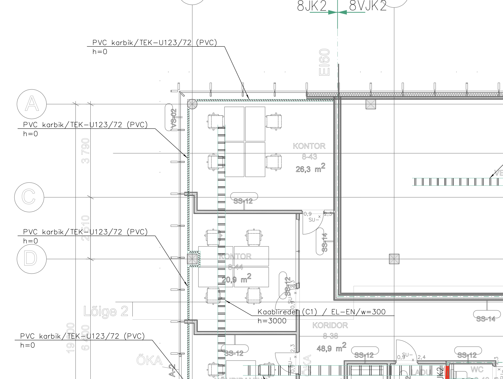

**4.4. Kaabliteed (plaanid, tüübid, markeerimine)**

Versioon: 1.0

Kuupäev: 15.04.2025

**1. Käsitlusala**

Käesolev kaart kirjeldab nõudeid **kaabliteede
tasapinnaplaanide** koostamisele elektripaigaldise projektides (tugev-
ja nõrkvool). See hõlmab nii riputatavaid (laealused, seintel) kui ka
põrandaaluseid kaabliteid. Eesmärk on tagada jooniste selgus,
informatiivsus ja vastavus standarditele ning heale tavale.

- **Asjakohased EHR koodid:** 5-1100 (Põrandaalused kaabliteed), 5-1200
  (Riputatavad kaabliteed)

**2. Seotud dokumendid ja viited**

- **Standardid:**

  - EVS 932:2017 Ehitusprojekt

  - Määrus "Nõuded ehitusprojektile"

  - EVS-EN ISO 5457: Jooniste vormistus

  - EVS-EN ISO 7200: Kirjanurk (ja teised vormistusstandardid)

  - EVS-EN ISO 3098, EVS-EN ISO 7083: Tekst joonistel (ja teised
    vormistusstandardid)

  - EVS-EN ISO 13567 (või vastav kehtiv standard): CAD kihid

- **Juhendid:**

  - MKM Juhendmaterjal - Ehitusprojekti dokumentide digitaalse
    vormistamise nõuded

  - Käesoleva juhendi peatükid: 3 (Dokumentatsiooni vormistus), 7 (BIM
    Nõuded), Lisa X (Tingmärgid).

**3. Üldnõuded Vormistusele**

- **Mõõtkava:** Üldjuhul 1:100. Kaabliteede ja kilpide
  teeninduspiirkondade üldplaanid võivad olla 1:200. Suure
  detailsusvajadusega alad (nt alajaamad) 1:50 Mõõtkava näidata
  kirjanurgas.

- **Formaat:** Standardne ISO A-seeria (A3, A2, A1). Võib kasutada
  pikendatud formaate (A3L jne), kui kõrgus vastab standardile

- **Layout:** Peab sisaldama graafilist osa, tingmärkide legendi ja
  standardset kirjanurka \[ Image x.x.x\]. Orienteeritus lugemiseks
  vasakult paremale.

- **Kirjanurk:** Peab vastama EVS-EN ISO 7200 nõuetele ja sisaldama
  vähemalt juhendis määratletud miinimuminfot \[Image x.x.x\].

- **Fondid:** Kasutada levinud platvormiüleseid fonte (nt ISOCPEUR,
  Arial). Teksti kõrgus (mõõtkavast sõltumata) 2.0-2.5 mm.

- **Kihid (Layers):** Kasutada standardset kihisüsteemi (nt ISO 13567).
  Eraldada kihiti tugevvoolu (EL), nõrkvoolu (EN) ja tulekindlad (TK)
  kaabliteed.

- **Alusplaanid:** Lisada Xref-ina (mitte kopeerida joonisesse).

- **Failinimed:** Vastavalt MKM juhendile ja käesoleva juhendi peatükile
  3.2.

- **Väljund:** Vektorkujul PDF-fail, kus on säilinud kihtide info ja
  teksti selekteerimise võimalus.

**4. Sisu Nõuded Staadiumite Kaupa**

| Staadium | Sisu Nõuded |
| -------- | ----------- |
| **EP**   | **Eelprojekt** (Fookus: põhimõtted, ruumivajadus) - Näidata **põhimagistraalide** (nii horisontaalseid kui vertikaalseid) asukohti ja ligikaudseid mõõtmeid/ruumivajadus. - Määratleda **elektri- ja nõrkvoolu tehnoruumide** (sh kilbiruumid, serveriruumid) ning **šahtide** asukohad ja ligikaudsed suurused koostöös arhitektiga. - Näidata **jaotuskeskuste** (pea-, korruse-) põhimõttelisi asukohti. - Määratleda kaabliteede **tüübid** üldiselt (nt riputatavad, põrandaalused). |
| **PP**   | **Põhiprojekt** (Fookus: detailsus, süsteemide eristamine, koordineerimine) - **Riputatavad kaabliteed (EHR 5-1200):** Näidata kõik kaabliredelid, -rennid, karbikud, tulekindlad teed. Eristada tüübid (nt kaetud/katmata) ja süsteemid (EL/EN/TK) mustri või värviga [Source 4312, Image 2]. Markeerida lõigud (Tüüp / Laius / Esialgne kõrgus) [Source 4313, Image 3]. Näidata ka lattliinid [Source 4324]. - **Põrandaalused kaabliteed (EHR 5-1100):** Näidata paigaldustorusid, põrandakarpe, põrandakanaleid, tõstetud põrandaaluseid teid. - **Jaotuskeskused:** Näidata täpsed asukohad, tüübid (TAVA/GEN/UPS värvidega) ja teeninduspiirkonnad. - **Avad:** Esitada avade ülesanne konstruktorile. Näidata vajalikud läbiviigud. - **Tuleohutustsoonid:** Vajadusel näidata TT-tsoonid. |
| **TP**   | **Tööprojekt** (Fookus: ehituslik täpsus, paigaldusinfo) - **Kõrgused ja Mõõdud:** Näidata **täpsed paigalduskõrgused** (alumine serv) kõikidele kaabliteedele, sh kõrguse muutumisel. Lisada mõõdud põrandakarbid ja muude väljaviikude mõõtmed. Määratleda kilpide täpsed gabariidid ja teenindusalade mõõtmed. Üldjuhul mõõtahelaid seadmetele ei lisata, v.a erijuhtudel. - **Kaabeldus:** Näidata **põhimagistraalide kaablipakid** (cable pack) kaabliteedel. - **Sõlmed ja Detailid:** Vajadusel lisada spetsiifilisi paigaldussõlme või detaile, eriti keerukamate lahenduste või liitumiste puhul. - **Avad:** Näidata lõplikud ehituslikud avad, mis tuleb tekitada. |

**5. Markeerimine ja Tähistus**

- **Kaabliteed:** Iga kaablitee lõik (eriti riputatav) peab olema
  varustatud viitega/tähisega, mis sisaldab vähemalt:

  - **Kaablitee tüüp:** (nt redel C1, renn C3, karbik K1, TK-tee jne)
    \[Image x.x.x\]

  - **Süsteem:** (nt EL, EN, TK - võib olla ka värvi/mustriga)

  - **Laius (w):** millimeetrites (nt w=300)

  - **Paigalduskõrgus (h):** Alumise serva absoluutkõrgus või kõrgus
    nullist (nt h=2400). Näidata kõrguse muutuskohtades.

  - *Näide viitest:* Redel (C1) / EL / w=300 / h=2400

- **Jaotuskeskused:** Tähistada vastavalt projektis kasutatavale
  süsteemile (nt JK1, PK, UPS-JK2). Eristada värviga tava-, gen.- ja
  UPS-toite kilbid.

- **Tingmärgid:** Kasutada standardseid või projektis defineeritud
  tingmärke. Kõik kasutatud tingmärgid peavad olema esitatud joonise
  legendis.

**6. BIM Nõuded**

- Kaabliteede modelleerimisel järgida juhendi peatükis 7 toodud nõudeid
  (LOD vastavalt staadiumile, parameetrid, kihid, ristumiste kontroll).

- Kaabliteed on oluline osa eriosade koordineerimisel ja ristumiste
  vältimisel BIM mudelis.

**7. Näited**

- Näide riputatavate kaabliteede markeerimisest \[Image 3\].

- Näide süsteemide eristamisest mustritega \[Image 2\].

- Näide kilbi teeninduspiirkonna ja tähistuse kohta \[Image 5\].

- Näide kaablipakkide kujutamisest (TP) \[Image 6\].

**8. Märkused ja Head Tavad**

- Kaabliteede planeerimisel arvestada teiste tehnosüsteemide (KVJVK,
  vesi-kanal) paiknemisega ja ruumivajadusega. Koostöö teiste eriosade
  projekteerijatega on kriitilise tähtsusega.

- Kaaluda kaabliteede täituvuse ja kandevõime arvutamist/hindamist
  keerukamate objektide puhul (eriti PP/TP staadiumis).

- Tööprojektis võib olla otstarbekas näidata kaablite järjestus
  kaabliteedel suuremate magistraalide puhul.

- Dokumenteerida ja kooskõlastada kõik avade ülesanded konstruktoriga
  õigeaegselt.
